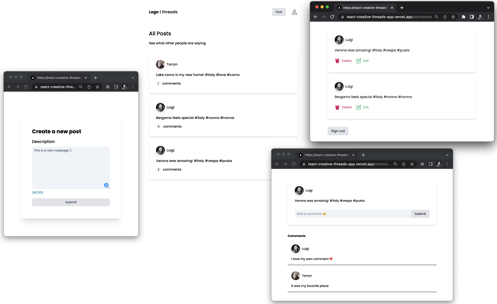

## Creative threads (with firebase)

> A posting/tweeting 📭 webapp demonstrating the interaction with firebase and Next.js.



Featuring:

- This is a [Next.js](https://nextjs.org/) project bootstrapped with [`create-next-app`](https://github.com/vercel/next.js/tree/canary/packages/create-next-app).
- Open my [vercel.app](https://react-creative-threads-app.vercel.app/) with your browser to see the result.
- All authentication and messaging (posts), is securely stored with **firebase**.
- Added **tailwindcss** support by following the [Install Tailwind CSS with Next.js](https://tailwindcss.com/docs/guides/nextjs) guide.
- Added [firebase](https://www.npmjs.com/package/firebase) support and functions to store and query user data.
- Register the firebase project as a Web-App to get your **Firebase SDK** to make use of functions like `getAuth, collection, onSnapshot`.
- Providers used are Google and Facebook.
- [React Firebase Hooks](https://www.npmjs.com/package/react-firebase-hooks) that offers a set of reusable React Hooks for Firebase.
- The `react-firebase-hooks/auth` helps with firebase interaction within our React application.
- The `useAuthState` hook is used to retrieve and monitor the authentication state from Firebase.

Dependencies:

```json
"dependencies": {
    "firebase": "^9.11.0",
    "next": "12.3.1",
    "react": "18.2.0",
    "react-dom": "18.2.0",
    "react-firebase-hooks": "^5.0.3",
    "react-icons": "^4.4.0",
    "react-toastify": "^9.0.8"
  },
```

Regards, <br />
Luigi Lupini <br />
<br />
I ❤️ all things (🇮🇹 / 🛵 / ☕️ / 👨‍👩‍👧)<br />

This is a [Next.js](https://nextjs.org/) project bootstrapped with [`create-next-app`](https://github.com/vercel/next.js/tree/canary/packages/create-next-app).

## Getting Started

First, run the development server:

```bash
npm run dev
# or
yarn dev
```

Open [http://localhost:3000](http://localhost:3000) with your browser to see the result.

You can start editing the page by modifying `pages/index.js`. The page auto-updates as you edit the file.

[API routes](https://nextjs.org/docs/api-routes/introduction) can be accessed on [http://localhost:3000/api/hello](http://localhost:3000/api/hello). This endpoint can be edited in `pages/api/hello.js`.

The `pages/api` directory is mapped to `/api/*`. Files in this directory are treated as [API routes](https://nextjs.org/docs/api-routes/introduction) instead of React pages.
